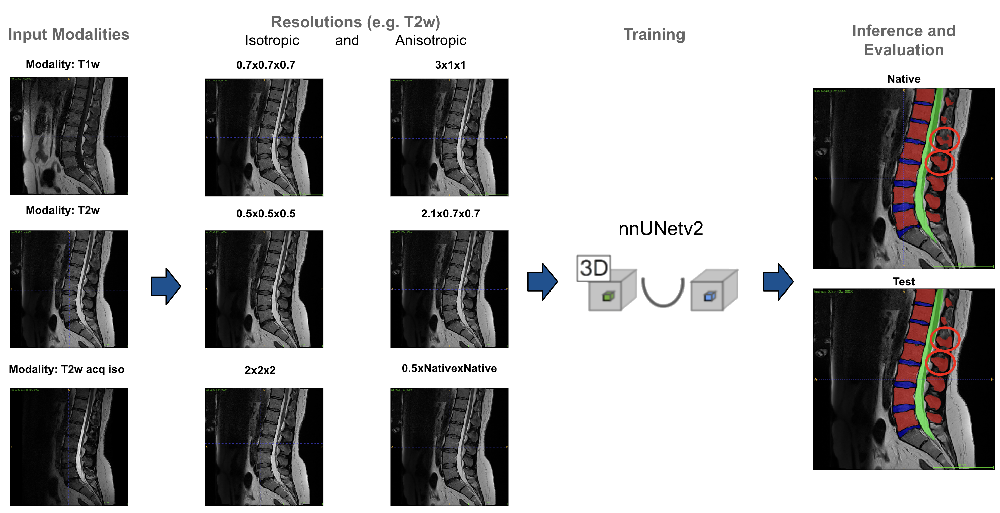
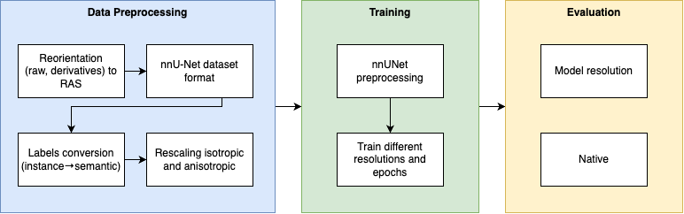

# Master Practical: Segmentation

Repository for the content of the practical course of Applied Deep Learning in Medicine (ADLM).

## Project goal

Evaluate the impact of image resolution on segmentation accuracy with different resolutions generated from the SPIDER dataset (Semantic Segmentation + Instance Segmentation).



## Overview

### Diagram

This flowchart provides the approach to prepare the data, train the models, and evaluate their performance.  



#### Data Preprocessing

1. **Reorientation (raw, derivatives) to RAS**: This step involves reorienting the raw data and its derivatives to a standard coordinate system, often referred to as RAS (Right-Anterior-Superior).
2. **Labels conversion (instance->semantic)**: This step involves converting instance labels to semantic labels, which is often required in semantic segmentation tasks.
3. **Rescaling isotropic and anisotropic**: This step involves rescaling the data, which can be done in both isotropic (equal in all directions) and anisotropic (different in different directions) manners.

    After these preprocessing steps, the data is in the “nnU-Net dataset format.”

#### Evaluation

1. **Model resolution**: This step involves evaluating the model at its trained resolution.
2. **Native**: This step involves evaluating the model at its native resolution.

#### Training

1. **nnU-Net preprocessing**: This step involves additional preprocessing specific to the nnU-Net framework.
2. **Train different resolutions and epochs**: This step involves training the model at different resolutions and for different numbers of epochs.

### Dataset

We are using the SPIDER dataset already normalized (0-1500). 

Original data are available on [Zenodo](https://zenodo.org/records/10159290).


## Prerrequisites

This installation assumes the following preconditions:

- Linux environment (this was developed in Ubuntu 22.04.4 LTS)
- Conda environment (24.1.2)
- Python 3.9


## Setup

### Setup the environment

Access this [setup file](setup.md) to configure your environment.

### Preprocessing

**Ensure you are working in the `segmentation` directory you created before.**

Assuming the dataset is downloaded, proceed with the next steps:

- Create a folder and name it `dataset-spider`
- Move the dataset in this directory
- You need to create two folders: `rawdata_normalized` and `derivatives_spider_new`.


#### Merge modalities

In this step, we need to ensure the dataset has this structure to manage the modalities T1w, T2W, and T2w_acq_iso.
<details>
<summary>Click to see the directory with the raw image structure. It contains the subjects from the three modalities.</summary>

```bash
rawdata_normalized
├── sub-0001
│   ├── T1w
│   │   └── sub-0001_T1w.nii.gz
│   └── T2w
│       └── sub-0001_T2w.nii.gz
├── sub-0002
│   ├── T1w
│   │   └── sub-0002_T1w.nii.gz
│   └── T2w
│       └── sub-0002_T2w.nii.gz
├── sub-0003
│   ├── T1w
│   │   └── sub-0003_T1w.nii.gz
│   └── T2w
│       └── sub-0003_T2w.nii.gz
├── sub-0004
│   ├── T1w
│   │   └── sub-0004_T1w.nii.gz
│   └── T2w
│       └── sub-0004_T2w.nii.gz
├── sub-0005
│   ├── T1w
│   │   └── sub-0005_T1w.nii.gz
│   └── T2w
│       ├── sub-0005_acq-iso_T2w.nii.gz
│       └── sub-0005_T2w.nii.gz
├── sub-0006
│   └── T2w
│       └── sub-0006_T2w.nii.gz
├── sub-0007
│   ├── T1w
│   │   └── sub-0007_T1w.nii.gz
│   └── T2w
│       ├── sub-0007_acq-iso_T2w.nii.gz
│       └── sub-0007_T2w.nii.gz
...
```

```bash
derivatives_spider_new
├── sub-0001
│   ├── T1w
│   │   ├── sub-0001_mod-T1w_seg-spider_msk.nii.gz
│   │   ├── sub-0001_mod-T1w_seg-subreg_msk.nii.gz
│   │   └── sub-0001_mod-T1w_seg-vert_msk.nii.gz
│   └── T2w
│       ├── sub-0001_mod-T2w_seg-spider_msk.nii.gz
│       ├── sub-0001_mod-T2w_seg-subreg_msk.nii.gz
│       └── sub-0001_mod-T2w_seg-vert_msk.nii.gz
├── sub-0002
│   ├── T1w
│   │   ├── sub-0002_mod-T1w_seg-spider_msk.nii.gz
│   │   ├── sub-0002_mod-T1w_seg-subreg_msk.nii.gz
│   │   └── sub-0002_mod-T1w_seg-vert_msk.nii.gz
│   └── T2w
│       ├── sub-0002_mod-T2w_seg-spider_msk.nii.gz
│       ├── sub-0002_mod-T2w_seg-subreg_msk.nii.gz
│       └── sub-0002_mod-T2w_seg-vert_msk.nii.gz
├── sub-0003
│   ├── T1w
│   │   ├── sub-0003_mod-T1w_seg-spider_msk.nii.gz
│   │   ├── sub-0003_mod-T1w_seg-subreg_msk.nii.gz
│   │   └── sub-0003_mod-T1w_seg-vert_msk.nii.gz
│   └── T2w
│       ├── sub-0003_mod-T2w_seg-spider_msk.nii.gz
│       ├── sub-0003_mod-T2w_seg-subreg_msk.nii.gz
│       └── sub-0003_mod-T2w_seg-vert_msk.nii.gz
├── sub-0004
│   ├── T1w
│   │   ├── sub-0004_mod-T1w_seg-spider_msk.nii.gz
│   │   ├── sub-0004_mod-T1w_seg-subreg_msk.nii.gz
│   │   └── sub-0004_mod-T1w_seg-vert_msk.nii.gz
│   └── T2w
│       ├── sub-0004_mod-T2w_seg-spider_msk.nii.gz
│       ├── sub-0004_mod-T2w_seg-subreg_msk.nii.gz
│       └── sub-0004_mod-T2w_seg-vert_msk.nii.gz
├── sub-0005
│   ├── T1w
│   │   ├── sub-0005_mod-T1w_seg-spider_msk.nii.gz
│   │   ├── sub-0005_mod-T1w_seg-subreg_msk.nii.gz
│   │   └── sub-0005_mod-T1w_seg-vert_msk.nii.gz
│   └── T2w
│       ├── sub-0005_acq-iso_mod-T2w_seg-spider_msk.nii.gz
│       ├── sub-0005_acq-iso_mod-T2w_seg-subreg_msk.nii.gz
│       ├── sub-0005_acq-iso_mod-T2w_seg-vert_msk.nii.gz
│       ├── sub-0005_mod-T2w_seg-spider_msk.nii.gz
│       ├── sub-0005_mod-T2w_seg-subreg_msk.nii.gz
│       └── sub-0005_mod-T2w_seg-vert_msk.nii.gz
...
```

</details>  

#### Reorient the data

We need to reorient the images to a unique orientation, let's do it to RAS (RAS means that the first dimension orients towards ***R***ight, the second dimension orients towards ***A***nterior, the third dimension orients towards ***S***uperior.)

Access this [reorientation.md](reorientation.md) file and follow to instructions to reorient the data.

#### nnU-Net dataset format

Convert the full dataset to the nnU-Net format, according to the official documentation [dataset format](https://github.com/MIC-DKFZ/nnUNet/blob/master/documentation/dataset_format.md).

Access this [dataset_format.md](dataset_format.md) file and follow to instructions to convert the full data.

#### Convert labels
The goal here is to convert the 14 labels in the derivatives to only 3 for simplicity (instance->semantic).

Access this script [convert_labels.md](convert_labels.md) file and follow to instructions to convert the labels.
