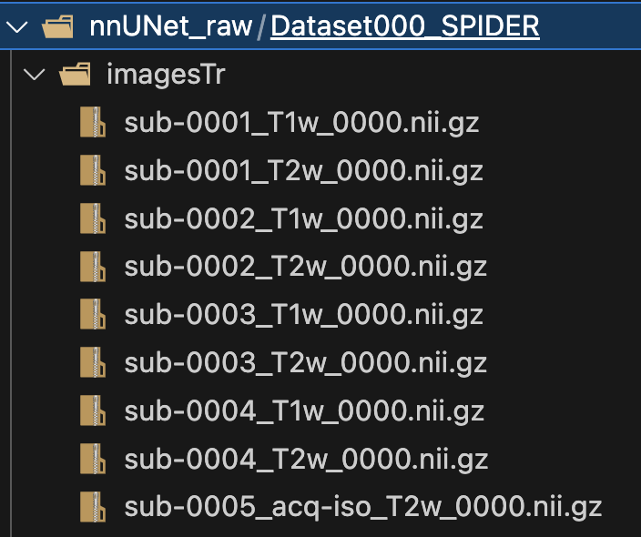
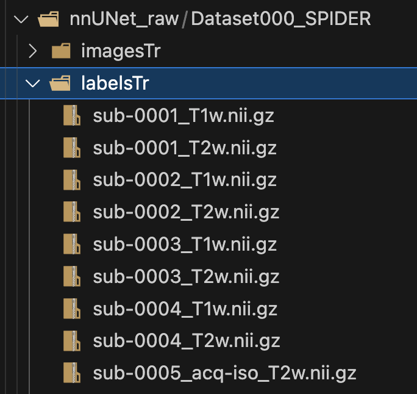

# nnU-Net dataset format

The only way to bring your data into nnU-Net is by storing it in a specific format.

Datasets consist of three components: raw images, corresponding segmentation maps and a dataset.json file specifying some metadata.

## Usage

* Open the [dataset_format.sh](shell/reorient_data.sh) script.
* Change the parameters in the lines 37-43 regarding to modify the dataset format.
  * **--full_dataset**: If it is the full dataset to be processed.
  * **--input_dir_imagesTr**: The imagesTr path to the directory with the modality .nii.gz. files
  * **--output_dir_imagesTr**: The imagesTr path where the reoriented .nii.gz files are going to be saved.
  * **--input_dir_labelsTr**: The labelsTr path to the directory with the modality .nii.gz. files
  * **--output_dir_labelsTr**: The labelsTr path where the reoriented .nii.gz files are going to be saved.
  * **--csv_file**: The path to save the dataset conversion information.

* Change the parameters in the lines 47-49 regarding to validate if the dataset conversion was correct.

    * **--csv_file**: The path where the dataset conversion information was saved.
    * **--report_file**: The path to save the dataset validation.

* Give execution permission to the shell script

    ```bash
    chmod +x shell/dataset_format.sh
    ```

* Run the script

    ```bash
    shell/dataset_format.sh
    ```

* Inspect the `.segmentation/logs/full_dataset_conversion.log` file.
We should see the print of files processed and some messages like this:

    ```log
    2024-07-05 17:49:23 | Initializing full dataset conversion.
    2024-07-05 17:49:23 | Initializing setup
    Directory nnUNet_raw/Dataset000_SPIDER/imagesTr created.
    Directory nnUNet_raw/Dataset000_SPIDER/labelsTr created.
    Starting imagestTr creation for Full Dataset

    Processing raw images directories:   0%|          | 0/217 [00:00<?, ?it/s]
    Processing raw images directories:   0%|          | 1/217 [00:00<01:29,  2.40it/s]
    Processing raw images directories:   1%|          | 2/217 [00:00<00:51,  4.15it/s]
    ...
    Processing derivatives directories: 100%|██████████| 220/220 [00:10<00:00, 22.06it/s]
    Processing derivatives directories: 100%|██████████| 220/220 [00:10<00:00, 21.07it/s]
    Validating data...
    Data validated, please the check the ./validation_full_dataset.csv for details.
    ```

## Output
After the correct execution, we should be able to see this directory structure:

