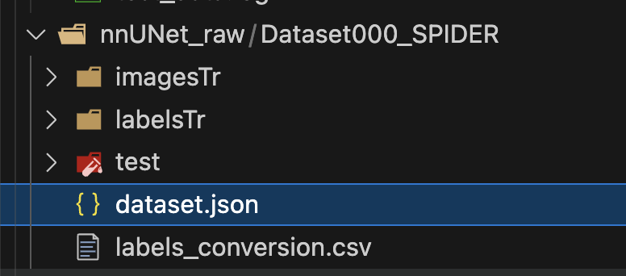

# Make JSON file

The goal is to create a JSON file with metadata to the nnUNet model to preprocess and validate the dataset.

## Usage

* Access the [make_test_data.sh](shell/make_test_data.sh) script and change the parameters in the lines 13-15 regarding:
  * **--directory**: Path to the directory containing .nii.gz files.
  * **--output_file**: Output JSON file path.

      So it would be something like this:

    ```bash
    python ./scripts/make_jsonfile.py \
        --directory ./nnUNet_raw/Dataset000_SPIDER/imagesTr \
        --output_file ./nnUNet_raw/Dataset000_SPIDER/dataset.json
    ```

* Give execution permission to the shell script

    ```bash
    chmod +x shell/make_json_file.sh
    ```

* Run the script

    ```bash
    shell/make_json_file.sh
    ```

* Inspect the `.segmentation/logs/make_json.log` file.
We should see the print of files processed, and a final line that says:

    ```log
    2024-07-05 18:43:34 | Creating dataset.json
    2024-07-05 18:43:35 | File dataset.json created.
    ```

## Output

The structure remains the same, but if you inspect one file and check the number of labels, you will see the JSON file called `dataset.json`.

