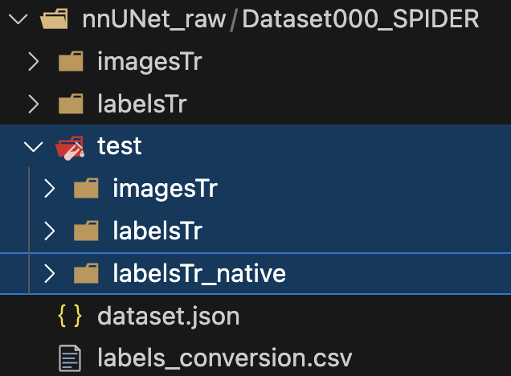

# Make test data

The goal is to split the dataset and have the test data that is going to be used to evaluate the performance of the model.

## Usage

* Access the [make_test_data.sh](shell/make_test_data.sh) script and change the parameters in the lines 29-35 regarding:
  * **--imagesTr_dir**: Path to the imagesTr directory
  * **--imagesTr_output_dir**: Path to the output directory for imagesTr
  * **--labelsTr_dir**: Path to the labelsTr directory with 4 labels converted.
  * **--labelsTr_output_dir**: Path to the output directory for labelsTr with 4 labels converted.
  * **--labelsTr_dir_native**: Path to the 15 labels directory
  * **--labelsTr_output_dir_native**: Path to the output labelsTr directory for the 15 labels.
  * **--list_files**: String representation of a list of file IDs to move.

  So it would be something like this:

    ```bash
    python ./segmentation/dataset-spider/full-dataset/scripts/move_test_data.py \
        --imagesTr_dir ./nnUNet_raw/Dataset000_SPIDER/imagesTr \
        --imagesTr_output_dir ./nnUNet_raw/Dataset000_SPIDER/test/imagesTr \
        --labelsTr_dir ./nnUNet_raw/Dataset000_SPIDER/labelsTr_tmp \
        --labelsTr_output_dir ./nnUNet_raw/Dataset000_SPIDER/test/labelsTr \
        --labelsTr_dir_native ./nnUNet_raw/Dataset000_SPIDER/labelsTr \
        --labelsTr_output_dir_native ./nnUNet_raw/Dataset000_SPIDER/test/labelsTr_native \
        --list_files "['0222', '0224', '0223', '0226', '0225', '0228', '0227', '0231', '0229', '0233', '0232', '0236', '0234', '0239', '0237', '0242', '0241', '0244', '0243', '0249', '0245', '0251', '0250', '0253', '0252', '0255', '0254', '0257', '0256']"
    ```

* Give execution permission to the shell script

    ```bash
    chmod +x shell/convert_labels.sh
    ```

* Run the script

    ```bash
    shell/convert_labels.sh
    ```

* Inspect the `.segmentation/logs/test_data.log` file.
We should see the print of files processed, and a final line that says:

    ```log
    2024-07-05 18:12:13 | Initializing test dataset creation.
    2024-07-05 18:12:13 | Directories test/imagesTr and test/labelsTr created.
    2024-07-05 18:12:13 | labelsTr with 14 labels deleted..
    2024-07-05 18:12:13 | labelsTr_tmp with 4 labels renamed to labelsTr.
    2024-07-05 18:12:13 | Test data moved.
    ```

## Output

The structure has changed, now there should be another folder called test, with this structure inside

