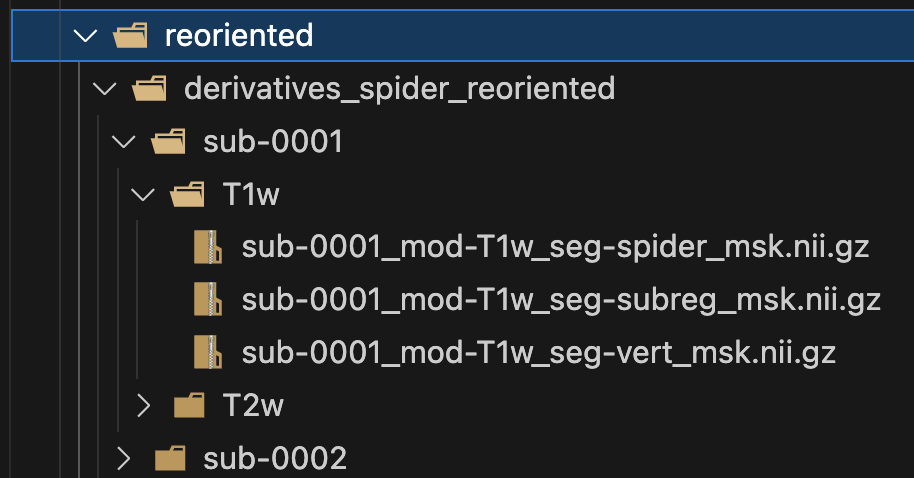

# Reorientate the data

We have two directories to reorient:

* **Derivatives**  
The `derivatives_spider_new` contains the raw segmentations from the SPIDER dataset.
* **Raw data**  
The `rawdata_normalized` contains the raw MRI images from the SPIDER dataset.

## Usage

* Access the [reorient_data.sh](shell/reorient_data.sh) script and change the parameters in the lines 12-16 and 18-22 regarding:
  * **--input_dir**: The path to the directory with the .nii.gz. files
  * **--output_dir**: The path where the reoriented .nii.gz files are going to be saved.
  * **--csv_file**: The path to save the reorientation information.

    So it would be something like this:

    * For **derivatives**

        ```bash
        python ./scripts/reorient-nii.py \
            --input_dir ./dataset-spider/derivatives_spider_new \
            --output_dir ./dataset-spider/reoriented/derivatives_spider_reoriented \
            --csv_file reorientation_derivatives_info.csv >> "./logs/reorientation.log" 2>&1
        ```

    * For **rawdata**

        ```bash
        python ./scripts/reorient-nii.py \
            --input_dir ./dataset-spider/rawdata_normalized \
            --output_dir ./dataset-spider/reoriented/rawdata_spider_reoriented \
            --csv_file reorientation_rawdata_info.csv >> "./logs/reorientation.log" 2>&1
        ```

* Give execution permission to the shell script

    ```bash
    chmod +x shell/reorient_data.sh
    ```

* Run the script

    ```bash
    shell/reorient_data.sh
    ```

* Inspect the `.segmentation/logs/reorientation.log` file.
We should see the print of files processed, and a final line that says:

    ```log
    [ ] Image reoriented from ('L', 'P', 'S') to ('R', 'A', 'S')
    [*] Save /segmentation/dataset-spider/reoriented/derivatives_spider_reoriented/sub-0213/T1w/sub-0213_mod-T1w_seg-subreg_msk.nii.gz as uint8
    [ ] Image reoriented from ('L', 'P', 'S') to ('R', 'A', 'S')
    [*] Save /segmentation/dataset-spider/reoriented/derivatives_spider_reoriented/sub-0213/T1w/sub-0213_mod-T1w_seg-vert_msk.nii.gz as uint8
    [ ] Image reoriented from ('L', 'P', 'S') to ('R', 'A', 'S')
    [*] Save /segmentation/dataset-spider/reoriented/derivatives_spider_reoriented/sub-0213/T1w/sub-0213_mod-T1w_seg-spider_msk.nii.gz as uint8
    Reorientation complete!
    2024-06-23 19:24:28 | Setup finished
    ```

## Output

We should see a new directory created called `reoriented` as follows:



If you open any image with Python, and inspect the orientation, you should see `RAS`.
